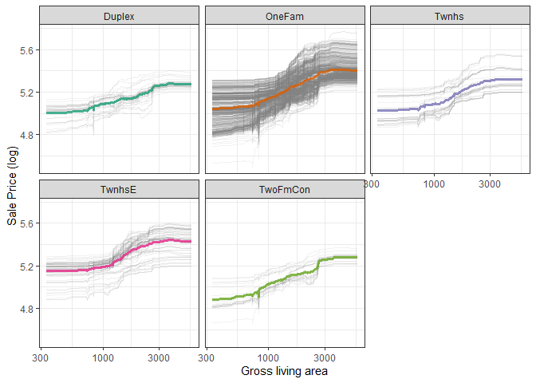

Key point of this chapter: how to ask a model why it makes the predictions it does.

linear regression: contains coefficients for each predictor that are typically straightforward to interpret.

random forests: can capture nonlinear behavior by design, it is less transparent how to explain the model's predictions from only the structure of the model itself. 

## 18.1 Software for model explanations

Tidymodels framework itself does not contain software for model explanations, but can explain models trained and evaluated with tidymodels with other software in R packages such as `lime`, `vip`, `DALEX`.

- `vip` functions when use model-based methods that take advantage of model structure (and are often faster) 
- `DALEX` functions when we want to use *model-agnostic* methods that can be applied to any model


Recall scripts in chapter 10 and chapter 11 to generate the models to predict the price of homes in Ames, IA, including a linear model with interactions and a random forest model.


```r
library(tidyverse) # load this for pipe operator
library(tidymodels)
```


```r
library(tidymodels)
data(ames)
ames <- mutate(ames, Sale_Price = log10(Sale_Price))

set.seed(502)
ames_split <- initial_split(ames, prop = 0.80, strata = Sale_Price)
ames_train <- training(ames_split)
ames_test  <-  testing(ames_split)

ames_rec <- 
  recipe(Sale_Price ~ Neighborhood + Gr_Liv_Area + Year_Built + Bldg_Type + 
           Latitude + Longitude, data = ames_train) %>%
  step_log(Gr_Liv_Area, base = 10) %>% 
  step_other(Neighborhood, threshold = 0.01) %>% 
  step_dummy(all_nominal_predictors()) %>% 
  step_interact( ~ Gr_Liv_Area:starts_with("Bldg_Type_") ) %>% 
  step_ns(Latitude, Longitude, deg_free = 20)

lm_model <- linear_reg() %>% set_engine("lm")

lm_wflow <- 
  workflow() %>% 
  add_model(lm_model) %>% 
  add_recipe(ames_rec)

lm_fit <- fit(lm_wflow, ames_train)

rf_model <- 
  rand_forest(trees = 1000) %>% 
  set_engine("ranger") %>% 
  set_mode("regression")

rf_wflow <- 
  workflow() %>% 
  add_formula(
    Sale_Price ~ Neighborhood + Gr_Liv_Area + Year_Built + Bldg_Type + 
      Latitude + Longitude) %>% 
  add_model(rf_model) 

rf_fit <- rf_wflow %>% fit(data = ames_train)
```


To build model-agnostic explainers for both of these models to find out why they make these predictions, use `DALEXtra` add-on package for `DALEX`.


To compute any kind of model explanation, global or local, using `DALEX`, first prepare the appropriate data and then create an explainer for each model:


```r
library(DALEXtra)
vip_features <- c("Neighborhood", "Gr_Liv_Area", "Year_Built", 
                  "Bldg_Type", "Latitude", "Longitude")

vip_train <- 
  ames_train %>% 
  select(all_of(vip_features))

explainer_lm <- 
  explain_tidymodels(
    lm_fit, 
    data = vip_train, 
    y = ames_train$Sale_Price,
    label = "lm + interactions",
    verbose = FALSE
  )

explainer_rf <- 
  explain_tidymodels(
    rf_fit, 
    data = vip_train, 
    y = ames_train$Sale_Price,
    label = "random forest",
    verbose = FALSE
  )
```


<!-- A linear model is typically straightforward to interpret and explain; you may not often find yourself using separate model explanation algorithms for a linear model. However, it can sometimes be difficult to understand or explain the predictions of even a linear model once it has splines and interaction terms! -->


Dealing with significant feature engineering transformations during model explainability highlights some options we have (or sometimes, ambiguity in such analyses). We can quantify global or local model explanations either in terms of:

- *original, basic predictors* as they existed without significant feature engineering transformations, or
- *derived features*, such as those created via dimensionality reduction (Chapter 16) or interactions and spline terms.


## 18.2 Local explanations

Local model explanations provide information about a prediction for a single observation. 

For example, take older duplex in the North Ames neighborhood (Section 4.1): 


```r
duplex <- vip_train[120,]
duplex
```

```
## # A tibble: 1 × 6
##   Neighborhood Gr_Liv_Area Year_Built Bldg_Type Latitude Longitude
##   <fct>              <int>      <int> <fct>        <dbl>     <dbl>
## 1 North_Ames          1040       1949 Duplex        42.0     -93.6
```

There are multiple possible approaches to understanding why a model predicts a given price for this duplex:
- One is a break-down explanation, implemented with the **DALEX** function `predic_part()`; it computes how contributions attributed to individual features change the mean model's prediction for a particular observation, like our duplex. 


```r
lm_breakdown <- predict_parts(explainer = explainer_lm, new_observation = duplex)
lm_breakdown
```

```
##                                              contribution
## lm + interactions: intercept                        5.221
## lm + interactions: Gr_Liv_Area = 1040              -0.082
## lm + interactions: Bldg_Type = Duplex              -0.049
## lm + interactions: Longitude = -93.608903          -0.043
## lm + interactions: Year_Built = 1949               -0.039
## lm + interactions: Latitude = 42.035841            -0.007
## lm + interactions: Neighborhood = North_Ames        0.001
## lm + interactions: prediction                       5.002
```
From the intercept of the linear model, the duplex status, size, longitude, and the age all contribute the most to the price. 


> Since this linear model was trained using spline terms for latitude and longitude, the contribution to price for Longitude shown here combines the effects of all of its individual spline terms. The contribution is in terms of the original Longitude feature, not the derived spline features.


For the random forest model, the most important features are slightly different, with the size, age, and duplex status being most important:


```r
rf_breakdown <- predict_parts(explainer = explainer_rf, new_observation = duplex)
rf_breakdown
```

```
##                                          contribution
## random forest: intercept                        5.221
## random forest: Year_Built = 1949               -0.076
## random forest: Gr_Liv_Area = 1040              -0.075
## random forest: Bldg_Type = Duplex              -0.027
## random forest: Longitude = -93.608903          -0.039
## random forest: Latitude = 42.035841            -0.028
## random forest: Neighborhood = North_Ames       -0.006
## random forest: prediction                       4.970
```

> Model break-down explanations like these depend on the *order* of the features.

We can change the relative importance of the features if we use *order* for the random forest model explanation to be the same as the default for the linear model.


```r
predict_parts(
  explainer = explainer_rf, 
  new_observation = duplex,
  order = lm_breakdown$variable_name
)
```

```
##                                          contribution
## random forest: intercept                        5.221
## random forest: Gr_Liv_Area = 1040              -0.075
## random forest: Bldg_Type = Duplex              -0.018
## random forest: Longitude = -93.608903          -0.021
## random forest: Year_Built = 1949               -0.102
## random forest: Latitude = 42.035841            -0.028
## random forest: Neighborhood = North_Ames       -0.006
## random forest: prediction                       4.970
```

<!-- Why the value of my output here is not the same as in the book, even I just copied their scripts? -->

Then we can use these break-down explanations change based on order to compute the most important features over all (or many) possible orderings.

Compute SHAP attributions for the duplex, using `B=20` random orderings:


```r
set.seed(1801)
shap_duplex <- 
  predict_parts(
    explainer = explainer_rf, 
    new_observation = duplex, 
    type = "shap",
    B = 20
  )
```

Use the default plot method from **DALEX** by calling `plot(shap_duplex)`:


```r
plot(shap_duplex)
```

<!-- -->

Or access the underlysing data and create a custom plot:

```r
library(forcats)
shap_duplex %>%
  group_by(variable) %>%
  mutate(mean_val = mean(contribution)) %>%
  ungroup() %>%
  mutate(variable = fct_reorder(variable, abs(mean_val))) %>%
  ggplot(aes(contribution, variable, fill = mean_val > 0)) +
  geom_col(data = ~distinct(., variable, mean_val), 
           aes(mean_val, variable), 
           alpha = 0.5) +
  geom_boxplot(width = 0.5) +
  theme(legend.position = "none") +
  theme_bw()+
  scale_fill_viridis_d() +
  labs(y = NULL)
```

<!-- -->

The box plots display the distribution of contributions across all the orderings, and the bars display the average attribution for each feature.

Try a different observation in the dataset. Look at a larger, newer one-family home in the Gilbert neighborhood:


```r
big_house <- vip_train[1269,]
big_house
```

```
## # A tibble: 1 × 6
##   Neighborhood Gr_Liv_Area Year_Built Bldg_Type Latitude Longitude
##   <fct>              <int>      <int> <fct>        <dbl>     <dbl>
## 1 Gilbert             2267       2002 OneFam        42.1     -93.6
```

Then compute SHAP average attributions for this house in the same way:


```r
set.seed(1802)
shap_house <- 
  predict_parts(
    explainer = explainer_rf, 
    new_observation = big_house, 
    type = "shap",
    B = 20
  )
```


Display the results:


```r
shap_house %>%
  group_by(variable) %>%
  mutate(mean_val = mean(contribution)) %>%
  ungroup() %>%
  mutate(variable = fct_reorder(variable, abs(mean_val))) %>%
  ggplot(aes(contribution, variable, fill = mean_val > 0)) +
  geom_col(data = ~distinct(., variable, mean_val), 
           aes(mean_val, variable), 
           alpha = 0.5) +
  geom_boxplot(width = 0.5) +
  theme(legend.position = "none") +
  theme_bw()+
  scale_fill_viridis_d() +
  labs(y = NULL)
```

<!-- -->

## 18.3 Global explanations

Global model explanations, also called global feature importance or variable importance, help us understand which features are most important in driving the predictions of the linear and random forest models overall, aggregated over the whole training set.

While the previous section addressed which variables or features are most important in predicting sale price for an individual home, global feature importance addresses the most important variables for a model in aggregate.

> One way to compute variable importance is to *permute* the feature, predict from the model, and then measure how much worse the model fits the data compared to before shuffling. This approach can be applied to any kind of model. 
- if shuffling a column causes a large degradation in model performance, it is important;
- if shuffling a column’s values doesn’t make much difference to how the model performs, it must not be an important variable

To compute this kind of variable importance via the `model_parts` function in **DALEX**:


```r
set.seed(1803)
vip_lm <- model_parts(explainer_lm, loss_function = loss_root_mean_square)
set.seed(1804)
vip_rf <- model_parts(explainer_rf, loss_function = loss_root_mean_square)
```

To plot using default plot method from **DALEX**:


```r
plot(vip_lm, vip_rf)
```

<!-- -->

The underlying data is available for exploration, analysis, and plotting. We can create a function for plotting:


```r
ggplot_imp <- function(...) {
  obj <- list(...)
  metric_name <- attr(obj[[1]], "loss_name")
  metric_lab <- paste(metric_name, 
                      "after permutations\n(higher indicates more important)")
  
  full_vip <- bind_rows(obj) %>%
    filter(variable != "_baseline_")
  
  perm_vals <- full_vip %>% 
    filter(variable == "_full_model_") %>% 
    group_by(label) %>% 
    summarise(dropout_loss = mean(dropout_loss))
  
  p <- full_vip %>%
    filter(variable != "_full_model_") %>% 
    mutate(variable = fct_reorder(variable, dropout_loss)) %>%
    ggplot(aes(dropout_loss, variable)) 
  if(length(obj) > 1) {
    p <- p + 
      facet_wrap(vars(label)) +
      geom_vline(data = perm_vals, aes(xintercept = dropout_loss, color = label),
                 linewidth = 1.4, lty = 2, alpha = 0.7) +
      geom_boxplot(aes(color = label, fill = label), alpha = 0.2)
  } else {
    p <- p + 
      geom_vline(data = perm_vals, aes(xintercept = dropout_loss),
                 linewidth = 1.4, lty = 2, alpha = 0.7) +
      geom_boxplot(fill = "#91CBD765", alpha = 0.4)
    
  }
  p +
    theme(legend.position = "none") +
    labs(x = metric_lab, 
         y = NULL,  fill = NULL,  color = NULL)
}
```


Then plot `vip_lm` and `vip_rf` with the created function:


```r
ggplot_imp(vip_lm, vip_rf)+theme_bw()
```

<!-- -->
In this figure:
- The dashed line in each panel shows the RMSE for the full model, either the linear model or the random forest model
- Features farther to the right are more important, because permuting them results in higher RMSE


## 18.4 Building global explanations from local explanations

So far in this chapter, we have focused on local model explanations for a single observation (via Shapley additive explanations) and global model explanations for a data set as a whole (via permuting features). It is also possible to build global model explanations by aggregating local model explanations, as with partial dependence profiles.

One way to build such a profile is by aggregating or averaging profiles for individual observations. A profile showing how an individual observation’s prediction changes as a function of a given feature is called an ICE (individual conditional expectation) profile or a CP (ceteris paribus) profile. 

To compute such individual profiles and then aggregate them, we can use `model_profile()` function in **DALEX**:


```r
set.seed(1805)
pdp_age <- model_profile(explainer_rf, N = 500, variables = "Year_Built")
```

Then create a function for plotting the underlying data in this object:


```r
ggplot_pdp <- function(obj, x) {
  p <- 
    as_tibble(obj$agr_profiles) %>%
    mutate(`_label_` = stringr::str_remove(`_label_`, "^[^_]*_")) %>%
    ggplot(aes(`_x_`, `_yhat_`)) +
    geom_line(data = as_tibble(obj$cp_profiles),
              aes(x = {{ x }}, group = `_ids_`),
              linewidth = 0.5, alpha = 0.05, color = "gray50")
  
  num_colors <- n_distinct(obj$agr_profiles$`_label_`)
  
  if (num_colors > 1) {
    p <- p + geom_line(aes(color = `_label_`), linewidth = 1.2, alpha = 0.8)
  } else {
    p <- p + geom_line(color = "midnightblue", linewidth = 1.2, alpha = 0.8)
  }
  
  p
}
```

Generate a figure to see the nonlinear behavior of the random forest model:


```r
ggplot_pdp(pdp_age, Year_Built)  +
  labs(x = "Year built", 
       y = "Sale Price (log)", 
       color = NULL)+
  theme_bw()
```

<!-- -->
Sale price for houses built in different years is mostly flat, with a modest rise after about 1960. Partial dependence profiles can be computed for any other feature in the model, and also for groups in the data, such as Bldg_Type. Let’s use 1,000 observations for these profiles.


```r
set.seed(1806)
pdp_liv <- model_profile(explainer_rf, N = 1000, 
                         variables = "Gr_Liv_Area", 
                         groups = "Bldg_Type")

ggplot_pdp(pdp_liv, Gr_Liv_Area) +
  scale_x_log10() +
  scale_color_brewer(palette = "Dark2") +
  labs(x = "Gross living area", 
       y = "Sale Price (log)", 
       color = NULL)+
  theme_bw()
```

<!-- -->

In the figure:

- sale price increases the most between about 1000 and 3000 square feet of living area,

- and that different home types (like single family homes or different types of townhouses) mostly exhibit similar increasing trends in price with more living space.

We can also use `facet_wrap` with one of the features to visualize if the predictions change differently and highlighting the imbalance in these subgroups：


```r
as_tibble(pdp_liv$agr_profiles) %>%
  mutate(Bldg_Type = stringr::str_remove(`_label_`, "random forest_")) %>%
  ggplot(aes(`_x_`, `_yhat_`, color = Bldg_Type)) +
  geom_line(data = as_tibble(pdp_liv$cp_profiles),
            aes(x = Gr_Liv_Area, group = `_ids_`),
            linewidth = 0.5, alpha = 0.1, color = "gray50") +
  geom_line(linewidth = 1.2, alpha = 0.8, show.legend = FALSE) +
  scale_x_log10() +
  facet_wrap(~Bldg_Type) +
  scale_color_brewer(palette = "Dark2") +
  labs(x = "Gross living area", 
       y = "Sale Price (log)", 
       color = NULL)+
  theme_bw()
```

<!-- -->

Another option for plotting using `plot(pdp_liv)`:


```r
plot(pdp_liv)
```

<!-- -->

## 18.5 Back to beans!

In Chapter 16, we discussed how to use dimensionality reduction as a feature engineering or preprocessing step when modeling high-dimensional data. For our example data set of dry bean morphology measures predicting bean type, we saw great results from partial least squares (PLS) dimensionality reduction combined with a regularized discriminant analysis model.

We can use the same approach outlined in this chapter to create a model-agnostic explainer and computer global model explanations via `model_parts()`, to evaluate which morphological characteristics was the *most* important in the bean type predictions.

Before we use `model_parts()` for bean data, we need to run some codes in chapter 16 to get the data:


```r
library(baguette)
library(discrim)
library(klaR)

rda_spec <-
  discrim_regularized(frac_common_cov = tune(), frac_identity = tune()) %>%
  set_engine('klaR')
```


```r
library(bestNormalize)
library(embed)
library(beans)
library(rsample)
```


```r
set.seed(1601)
bean_split <- initial_validation_split(beans, strata = class, prop = c(0.75, 0.125))

bean_train <- training(bean_split)
bean_test <- testing(bean_split)
bean_validation <- validation(bean_split)
```


```r
set.seed(1602)
bean_val <- validation_set(bean_split)
bean_val$splits[[1]]
```

```
## <Training/Validation/Total>
## <10206/1702/11908>
```


```r
library(parsnip)
library(discrim)
```


```r
bean_rec <-
  recipe(class ~ ., data = bean_train) %>%
  step_zv(all_numeric_predictors()) %>%
  step_orderNorm(all_numeric_predictors()) %>%
  step_normalize(all_numeric_predictors())

pls_rec <-
  bean_rec %>%
  step_pls(all_numeric_predictors(), outcome = "class", num_comp = tune())


ctrl <- control_grid(parallel_over = "everything")
bean_res <-
  workflow_set(
    preproc = list(basic = class ~., pls = pls_rec),
    models = list(rda = rda_spec)
  ) %>%
  workflow_map(
    verbose = TRUE,
    seed = 1603,
    resamples = bean_val,
    grid = 10,
    metrics = metric_set(roc_auc),
    control = ctrl
  )

rda_res <-
  bean_res %>%
  extract_workflow("pls_rda") %>%
  finalize_workflow(
    bean_res %>%
      extract_workflow_set_result("pls_rda") %>%
      select_best(metric = "roc_auc")
  ) %>%
  last_fit(split = bean_split, metrics = metric_set(roc_auc))

rda_wflow_fit <- extract_workflow(rda_res)
```


Now we can use `model_parts()`:


```r
library(DALEX)
library(DALEXtra)
```


```r
set.seed(1807)
vip_beans <-
  explain_tidymodels(
    rda_wflow_fit,
    data = bean_train,
    y = bean_train$class,
    label = "RDA",
    verbose = FALSE
  ) %>%
  model_parts()
```

Then we can use our previously defined importance plotting function `ggplot_imp(vip_beans)` to produce a figure of global explainer for the regularized discriminant analysis model on the beans data.


```r
ggplot_imp(vip_beans)+
  theme_bw()
```

<!-- -->

The figure shows that shape factors are among the most important features for predicting bean type, especially shape factor 4. Shape factor 1 (the ratio of the major axis to the area), the minor axis length, and roundness are the next most important bean characteristics for predicting bean variety.


