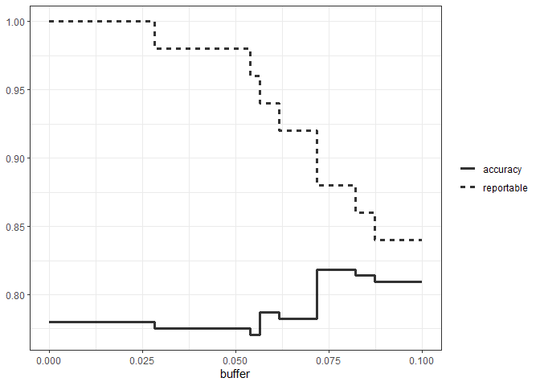
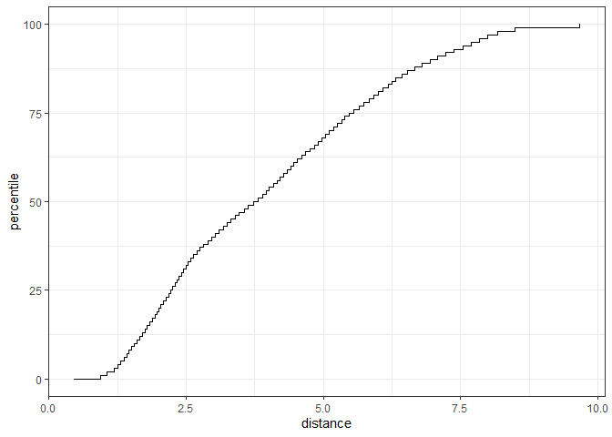

# 19 When should you trust your predictions?

A predictive model can almost always produce a prediction, given input data. However, when a new data point is well outside of the range of data used to create the model, making a prediction may be an inappropriate extrapolation. Another example of an inappropriate prediction would be when the model is used in a completely different context, for instance, a model that built from human breast cancer cells could be inappropriately applied to stomach cells for the same purpose. We can produce a prediction but it is unlikely to be applicable to the different cell type.

This chapter discusses two methods for quantifying the potential quality of a prediction:

- **`Equivocal zones`** use the predicted values to alert the user that results may be suspect.
- **`Applicability`** uses the predictors to measure the amount of extrapolation (if any) for new samples.


## 19.1 Equivocal results

Let’s use a function that can simulate classification data with two classes and two predictors (`x` and `y`). The true model is a logistic regression model with the equation:

$$
logit(p) = -1 - 2x - \frac{x^2}{5} + 2y^2 
$$


```r
library(tidymodels)
tidymodels_prefer()

simulate_two_classes <- 
  function (n, error = 0.1, eqn = quote(-1 - 2 * x - 0.2 * x^2 + 2 * y^2))  {
    # Slightly correlated predictors
    sigma <- matrix(c(1, 0.7, 0.7, 1), nrow = 2, ncol = 2)
    dat <- MASS::mvrnorm(n = n, mu = c(0, 0), Sigma = sigma)
    colnames(dat) <- c("x", "y")
    cls <- paste0("class_", 1:2)
    dat <- 
      as_tibble(dat) %>% 
      mutate(
        linear_pred = !!eqn,
        # Add some misclassification noise
        linear_pred = linear_pred + rnorm(n, sd = error),
        prob = binomial()$linkinv(linear_pred),
        class = ifelse(prob > runif(n), cls[1], cls[2]),
        class = factor(class, levels = cls)
      )
    dplyr::select(dat, x, y, class)
  }

set.seed(1901)
training_set <- simulate_two_classes(200)
testing_set  <- simulate_two_classes(50)
```

Then we estimate a logistic regression model using Bayesian methods (using the default Gaussian prior distributions for the parameters):


```r
# install.packages("rstanarm")
```


```r
two_class_mod <- 
  logistic_reg() %>% 
  set_engine("stan", seed = 1902) %>% 
  fit(class ~ . + I(x^2)+ I(y^2), data = training_set)
print(two_class_mod, digits = 3)
```

```
## parsnip model object
## 
## stan_glm
##  family:       binomial [logit]
##  formula:      class ~ . + I(x^2) + I(y^2)
##  observations: 200
##  predictors:   5
## ------
##             Median MAD_SD
## (Intercept)  1.092  0.287
## x            2.290  0.423
## y            0.314  0.354
## I(x^2)       0.077  0.307
## I(y^2)      -2.465  0.424
## 
## ------
## * For help interpreting the printed output see ?print.stanreg
## * For info on the priors used see ?prior_summary.stanreg
```


The data points closest to the class boundary are the most uncertain. If their values changed slightly, their predicted class might change. One simple method for disqualifying some results is to call them “equivocal” if the values are within some range around 50% (or the appropriate probability cutoff for a certain situation).

We could base the width of the band around the cutoff on how performance improves when the uncertain results are removed. However, we should also estimate the reportable rate (the expected proportion of usable results). 

We can use the test set to determine the balance between improving performance and having enough reportable results. 

To create the predictions:


```r
test_pred <- augment(two_class_mod, testing_set)
test_pred %>% head()
```

```
## # A tibble: 6 × 6
##   .pred_class .pred_class_1 .pred_class_2      x      y class  
##   <fct>               <dbl>         <dbl>  <dbl>  <dbl> <fct>  
## 1 class_2           0.0256          0.974  1.12  -0.176 class_2
## 2 class_1           0.555           0.445 -0.126 -0.582 class_2
## 3 class_2           0.00620         0.994  1.92   0.615 class_2
## 4 class_2           0.472           0.528 -0.400  0.252 class_2
## 5 class_2           0.163           0.837  1.30   1.09  class_1
## 6 class_2           0.0317          0.968  2.59   1.36  class_2
```

With tidymodels, the **probably** package contains functions for equivocal zones. For cases with two classes, the `make_two_class_pred()` function creates a factor-like column that has the predicted classes with an equivocal zone:


```r
# install.packages("probably")
library(probably)

lvls <- levels(training_set$class)

test_pred <- 
  test_pred %>% 
  mutate(.pred_with_eqz = make_two_class_pred(.pred_class_1, lvls, buffer = 0.15))

test_pred %>% count(.pred_with_eqz)
```

```
## # A tibble: 3 × 2
##   .pred_with_eqz     n
##       <clss_prd> <int>
## 1           [EQ]     9
## 2        class_1    20
## 3        class_2    21
```

Rows that are within 0.50±0.15 are given a value of `[EQ]`.

Since the factor levels are the same as the original data, confusion matrices and other statistics can be computed without error. When using standard functions from the **yardstick** package, the equivocal results are converted to `NA` and are not used in the calculations that use the hard class predictions. Notice the differences in these confusion matrices:


```r
# All data
test_pred %>% conf_mat(class, .pred_class)
```

```
##           Truth
## Prediction class_1 class_2
##    class_1      20       6
##    class_2       5      19
```


```r
# Reportable results only: 
test_pred %>% conf_mat(class, .pred_with_eqz)
```

```
##           Truth
## Prediction class_1 class_2
##    class_1      17       3
##    class_2       5      16
```

Try with different buffer size to see if the equivocal zone help improve accuracy:


```r
# A function to change the buffer then compute performance.
eq_zone_results <- function(buffer) {
  test_pred <- 
    test_pred %>% 
    mutate(.pred_with_eqz = make_two_class_pred(.pred_class_1, lvls, buffer = buffer))
  acc <- test_pred %>% accuracy(class, .pred_with_eqz)
  rep_rate <- reportable_rate(test_pred$.pred_with_eqz)
  tibble(accuracy = acc$.estimate, reportable = rep_rate, buffer = buffer)
}

# Evaluate a sequence of buffers and plot the results. 
map(seq(0, .1, length.out = 40), eq_zone_results) %>% 
  list_rbind() %>% 
  pivot_longer(c(-buffer), names_to = "statistic", values_to = "value") %>% 
  ggplot(aes(x = buffer, y = value, lty = statistic)) + 
  geom_step(linewidth = 1.2, alpha = 0.8) + 
  labs(y = NULL, lty = NULL)+
  theme_bw()
```

<!-- -->

The figure shows that accuracy improves by a few percentage points but at the cost of nearly 10% of predictions being unusable! 

This analysis focused on using the predicted class probability to disqualify points, since this is a fundamental measure of uncertainty in classification models. A slightly better approach would be to use the standard error of the class probability. 

One important aspect of the standard error of prediction is that it takes into account more than just the class probability. In cases where there is significant extrapolation or aberrant predictor values, the standard error might increase. The benefit of using the standard error of prediction is that it might also flag predictions that are problematic (as opposed to simply uncertain). 

For our test set, using `type = "pred_int"` will produce upper and lower limits and the `std_error` adds a column for that quantity. For 80% intervals:


```r
test_pred <- 
  test_pred %>% 
  bind_cols(
    predict(two_class_mod, testing_set, type = "pred_int", std_error = TRUE)
  )
```


## 19.2 Determining model applicability

Equivocal zones try to measure the reliability of a prediction based on the model outputs. It may be that model statistics, such as the standard error of prediction, cannot measure the impact of extrapolation, and so we need another way to assess whether to trust a prediction.

Take the Chicago train data as an example. The goal is to predict the number of customers entering the Clark and Lake train station each day.

The data set contains daily values between January 22, 2001 and August 28, 2016.

Create a small test using the last two weeks of the data:


```r
## loads both `Chicago` data set as well as `stations`
data(Chicago)

Chicago <- Chicago %>% select(ridership, date, one_of(stations))

n <- nrow(Chicago)

Chicago_train <- Chicago %>% slice(1:(n - 14))
Chicago_test  <- Chicago %>% slice((n - 13):n)
```

Fit a standard linear model using the pre-processed data:


```r
base_recipe <-
  recipe(ridership ~ ., data = Chicago_train) %>%
  # Create date features
  step_date(date) %>%
  step_holiday(date, keep_original_cols = FALSE) %>%
  # Create dummy variables from factor columns
  step_dummy(all_nominal()) %>%
  # Remove any columns with a single unique value
  step_zv(all_predictors()) %>%
  step_normalize(!!!stations)%>%
  step_pls(!!!stations, num_comp = 10, outcome = vars(ridership))

lm_spec <-
  linear_reg() %>%
  set_engine("lm") 

lm_wflow <-
  workflow() %>%
  add_recipe(base_recipe) %>%
  add_model(lm_spec)

set.seed(1902)
lm_fit <- fit(lm_wflow, data = Chicago_train)
```


Use `predict()` on the test set to find both predictions and prediction intervals so that we can see how well the data fit on the test set:


```r
res_test <-
  predict(lm_fit, Chicago_test) %>%
  bind_cols(
    predict(lm_fit, Chicago_test, type = "pred_int"),
    Chicago_test
  )

res_test %>% select(date, ridership, starts_with(".pred"))
```

```
## # A tibble: 14 × 5
##    date       ridership .pred .pred_lower .pred_upper
##    <date>         <dbl> <dbl>       <dbl>       <dbl>
##  1 2016-08-15     20.6  20.3        16.2         24.5
##  2 2016-08-16     21.0  21.3        17.1         25.4
##  3 2016-08-17     21.0  21.4        17.3         25.6
##  4 2016-08-18     21.3  21.4        17.3         25.5
##  5 2016-08-19     20.4  20.9        16.7         25.0
##  6 2016-08-20      6.22  7.52        3.34        11.7
##  7 2016-08-21      6.62  6.34        2.19        10.5
##  8 2016-08-22     21.2  20.2        16.1         24.3
##  9 2016-08-23     21.3  21.3        17.1         25.4
## 10 2016-08-24     20.7  21.5        17.4         25.6
## 11 2016-08-25     21.3  21.4        17.3         25.5
## 12 2016-08-26     20.5  20.7        16.5         24.8
## 13 2016-08-27      6.27  8.31        4.18        12.4
## 14 2016-08-28      5.63  7.18        3.05        11.3
```
The results are fairly good!

Test for 2020 data:


```r
load("Chicago_2020.RData")

res_2020 <-
  predict(lm_fit, Chicago_2020) %>%
  bind_cols(
    predict(lm_fit, Chicago_2020, type = "pred_int"),
    Chicago_2020
  ) 

res_2020 %>% select(date, contains(".pred"))
```

```
## # A tibble: 14 × 4
##    date       .pred .pred_lower .pred_upper
##    <date>     <dbl>       <dbl>       <dbl>
##  1 2020-06-01 20.1        15.9         24.3
##  2 2020-06-02 21.4        17.2         25.6
##  3 2020-06-03 21.5        17.3         25.6
##  4 2020-06-04 21.3        17.1         25.4
##  5 2020-06-05 20.7        16.6         24.9
##  6 2020-06-06  9.04        4.88        13.2
##  7 2020-06-07  7.84        3.69        12.0
##  8 2020-06-08 20.3        16.1         24.4
##  9 2020-06-09 21.4        17.2         25.6
## 10 2020-06-10 21.5        17.3         25.7
## 11 2020-06-11 21.2        17.0         25.4
## 12 2020-06-12 20.7        16.5         24.9
## 13 2020-06-13  9.02        4.86        13.2
## 14 2020-06-14  7.90        3.74        12.1
```

The prediction intervals are about the same width, even though these data are well beyond the time period of the original training set. However, given the global pandemic in 2020, the performance on these data are abysmal:


```r
res_2020 %>% select(date, ridership, starts_with(".pred"))
```

```
## # A tibble: 14 × 5
##    date       ridership .pred .pred_lower .pred_upper
##    <date>         <dbl> <dbl>       <dbl>       <dbl>
##  1 2020-06-01     0.002 20.1        15.9         24.3
##  2 2020-06-02     0.005 21.4        17.2         25.6
##  3 2020-06-03     0.566 21.5        17.3         25.6
##  4 2020-06-04     1.66  21.3        17.1         25.4
##  5 2020-06-05     1.95  20.7        16.6         24.9
##  6 2020-06-06     1.08   9.04        4.88        13.2
##  7 2020-06-07     0.655  7.84        3.69        12.0
##  8 2020-06-08     1.69  20.3        16.1         24.4
##  9 2020-06-09     1.65  21.4        17.2         25.6
## 10 2020-06-10     1.73  21.5        17.3         25.7
## 11 2020-06-11     1.80  21.2        17.0         25.4
## 12 2020-06-12     1.83  20.7        16.5         24.9
## 13 2020-06-13     0.969  9.02        4.86        13.2
## 14 2020-06-14     0.737  7.90        3.74        12.1
```


```r
res_2020 %>% rmse(ridership, .pred)
```

```
## # A tibble: 1 × 3
##   .metric .estimator .estimate
##   <chr>   <chr>          <dbl>
## 1 rmse    standard        17.2
```

The model performance is visually terrible!

Sometimes the statistics produced by models don’t measure the quality of predictions very well. This situation can be avoided by having a secondary methodology that can quantify how applicable the model is for any new prediction (i.e., the model’s *applicability domain*). Here we use a simple unsupervised method - PCA, to measure how much (if any) a new data point is beyond the training data. 


```r
# install.packages("applicable")
library(applicable)
pca_stat <- apd_pca(~ ., data = Chicago_train %>% select(one_of(stations)), 
                    threshold = 0.99)
pca_stat
```

```
## # Predictors:
##    20
## # Principal Components:
##    9 components were needed
##    to capture at least 99% of the
##    total variation in the predictors.
```


```r
autoplot(pca_stat, distance) + labs(x = "distance") + theme_bw()
```

<!-- -->


```r
score(pca_stat, Chicago_test) %>% select(starts_with("distance"))
```

```
## # A tibble: 14 × 2
##    distance distance_pctl
##       <dbl>         <dbl>
##  1     4.88          66.7
##  2     5.21          71.4
##  3     5.19          71.1
##  4     5.00          68.5
##  5     4.36          59.3
##  6     4.10          55.2
##  7     5.59          76.4
##  8     4.21          56.9
##  9     4.94          67.5
## 10     4.93          67.4
## 11     4.93          67.3
## 12     3.50          47.4
## 13     3.89          52.1
## 14     5.42          74.4
```

For the 2020 data:


```r
score(pca_stat, Chicago_2020) %>% select(starts_with("distance"))
```

```
## # A tibble: 14 × 2
##    distance distance_pctl
##       <dbl>         <dbl>
##  1     9.39          99.8
##  2     9.40          99.8
##  3     9.30          99.7
##  4     9.30          99.7
##  5     9.29          99.7
##  6    10.1            1  
##  7    10.2            1  
##  8    10.1            1  
##  9     9.30          99.7
## 10     9.22          99.6
## 11     9.26          99.7
## 12     9.12          99.5
## 13     9.80           1  
## 14    10.7            1
```

