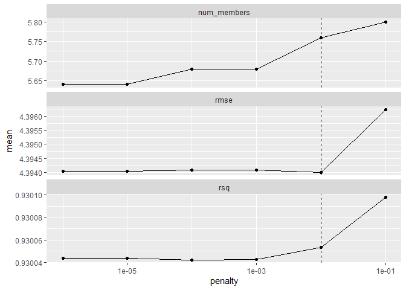
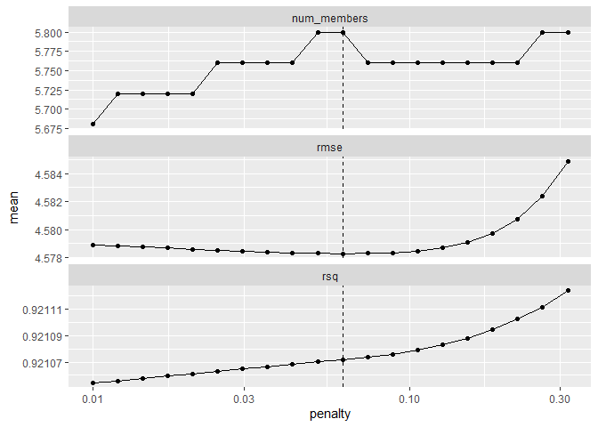
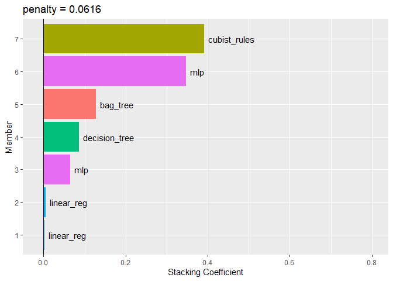

## Ensembles of Models

A model ensemble, where the predictions of multiple single learners are aggregated to make one prediction, can produce a high-performance final model. The most popular methods for creating ensemble models are bagging (Breiman 1996a), random forest (Ho 1995; Breiman 2001a), and boosting (Freund and Schapire 1997). Each of these methods combines the predictions from multiple versions of the same type of model (e.g., classifications trees). However, one of the earliest methods for creating ensembles is model stacking (Wolpert 1992; Breiman 1996b).

Model stacking combines the predictions for multiple models of any type. For example, a logistic regression, classification tree, and support vector machine can be included in a stacking ensemble.

This chapter shows how to stack predictive models using the stacks package. We’ll re-use the results from Chapter 15 where multiple models were evaluated to predict the compressive strength of concrete mixtures.

The process of building a stacked ensemble is:

- Assemble the training set of hold-out predictions (produced via resampling).
- Create a model to blend these predictions.
- For each member of the ensemble, fit the model on the original training set.

Let’s consider the multilayer perceptron (MLP) model (a.k.a. neural network) created in Chapter 15.

In general, we’ll talk about an MLP model as the type of model. Linear regression and support vector machines are other model types.

Tuning parameters are an important aspect of a model. Back in Chapter 15, the MLP model was tuned over 25 tuning parameter values. In the previous chapters, we’ve called these candidate tuning parameter values or model configurations. In literature on ensembling these have also been called the base models.

### 20.1 Creating the training set for stacking

The first step for building a stacked ensemble relies on the assessment set predictions from a resampling scheme with multiple splits. For each data point in the training set, stacking requires an out-of-sample prediction of some sort. For regression models, this is the predicted outcome. For classification models, the predicted classes or probabilities are available for use, although the latter contains more information than the hard class predictions. For a set of models, a data set is assembled where rows are the training set samples and columns are the out-of-sample predictions from the set of multiple models.

Back in Chapter 15, we used five repeats of 10-fold cross-validation to resample the data. This resampling scheme generates five assessment set predictions for each training set sample. Multiple out-of-sample predictions can occur in several other resampling techniques (e.g., bootstrapping). For the purpose of stacking, any replicate predictions for a data point in the training set are averaged so that there is a single prediction per training set sample per candidate member.

To start ensembling with the **stacks** package, create an empty data stack using the `stacks()` function and then add candidate models. Recall that we used workflow sets to fit a wide variety of models to these data. We’ll use the racing results:


```r
library(tidymodels)
library(stacks)
tidymodels_prefer()
```


```r
concrete <- 
   concrete %>% 
   group_by(across(-compressive_strength)) %>% 
   summarize(compressive_strength = mean(compressive_strength),
             .groups = "drop")
nrow(concrete)
```

```
## [1] 992
```


```r
set.seed(1501)
concrete_split <- initial_split(concrete, strata = compressive_strength)
concrete_train <- training(concrete_split)
concrete_test  <- testing(concrete_split)

set.seed(1502)
concrete_folds <- 
   vfold_cv(concrete_train, strata = compressive_strength, repeats = 5)
```


```r
normalized_rec <- 
   recipe(compressive_strength ~ ., data = concrete_train) %>% 
   step_normalize(all_predictors()) 

poly_recipe <- 
   normalized_rec %>% 
   step_poly(all_predictors()) %>% 
   step_interact(~ all_predictors():all_predictors())
```


```r
library(rules)
library(baguette)

linear_reg_spec <- 
   linear_reg(penalty = tune(), mixture = tune()) %>% 
   set_engine("glmnet")

nnet_spec <- 
   mlp(hidden_units = tune(), penalty = tune(), epochs = tune()) %>% 
   set_engine("nnet", MaxNWts = 2600) %>% 
   set_mode("regression")

mars_spec <- 
   mars(prod_degree = tune()) %>%  #<- use GCV to choose terms
   set_engine("earth") %>% 
   set_mode("regression")

svm_r_spec <- 
   svm_rbf(cost = tune(), rbf_sigma = tune()) %>% 
   set_engine("kernlab") %>% 
   set_mode("regression")

svm_p_spec <- 
   svm_poly(cost = tune(), degree = tune()) %>% 
   set_engine("kernlab") %>% 
   set_mode("regression")

knn_spec <- 
   nearest_neighbor(neighbors = tune(), dist_power = tune(), weight_func = tune()) %>% 
   set_engine("kknn") %>% 
   set_mode("regression")

cart_spec <- 
   decision_tree(cost_complexity = tune(), min_n = tune()) %>% 
   set_engine("rpart") %>% 
   set_mode("regression")

bag_cart_spec <- 
   bag_tree() %>% 
   set_engine("rpart", times = 50L) %>% 
   set_mode("regression")

rf_spec <- 
   rand_forest(mtry = tune(), min_n = tune(), trees = 1000) %>% 
   set_engine("ranger") %>% 
   set_mode("regression")

xgb_spec <- 
   boost_tree(tree_depth = tune(), learn_rate = tune(), loss_reduction = tune(), 
              min_n = tune(), sample_size = tune(), trees = tune()) %>% 
   set_engine("xgboost") %>% 
   set_mode("regression")

cubist_spec <- 
   cubist_rules(committees = tune(), neighbors = tune()) %>% 
   set_engine("Cubist") 
```


```r
nnet_param <- 
   nnet_spec %>% 
   extract_parameter_set_dials() %>% 
   update(hidden_units = hidden_units(c(1, 27)))
```


```r
normalized <- 
   workflow_set(
      preproc = list(normalized = normalized_rec), 
      models = list(SVM_radial = svm_r_spec, SVM_poly = svm_p_spec, 
                    KNN = knn_spec, neural_network = nnet_spec)
   )
normalized
```

```
## # A workflow set/tibble: 4 × 4
##   wflow_id                  info             option    result    
##   <chr>                     <list>           <list>    <list>    
## 1 normalized_SVM_radial     <tibble [1 × 4]> <opts[0]> <list [0]>
## 2 normalized_SVM_poly       <tibble [1 × 4]> <opts[0]> <list [0]>
## 3 normalized_KNN            <tibble [1 × 4]> <opts[0]> <list [0]>
## 4 normalized_neural_network <tibble [1 × 4]> <opts[0]> <list [0]>
```


```r
normalized %>% extract_workflow(id = "normalized_KNN")
```

```
## ══ Workflow ════════════════════════════════════════════════════════════════════
## Preprocessor: Recipe
## Model: nearest_neighbor()
## 
## ── Preprocessor ────────────────────────────────────────────────────────────────
## 1 Recipe Step
## 
## • step_normalize()
## 
## ── Model ───────────────────────────────────────────────────────────────────────
## K-Nearest Neighbor Model Specification (regression)
## 
## Main Arguments:
##   neighbors = tune()
##   weight_func = tune()
##   dist_power = tune()
## 
## Computational engine: kknn
```


```r
normalized <- 
   normalized %>% 
   option_add(param_info = nnet_param, id = "normalized_neural_network")
normalized
```

```
## # A workflow set/tibble: 4 × 4
##   wflow_id                  info             option    result    
##   <chr>                     <list>           <list>    <list>    
## 1 normalized_SVM_radial     <tibble [1 × 4]> <opts[0]> <list [0]>
## 2 normalized_SVM_poly       <tibble [1 × 4]> <opts[0]> <list [0]>
## 3 normalized_KNN            <tibble [1 × 4]> <opts[0]> <list [0]>
## 4 normalized_neural_network <tibble [1 × 4]> <opts[1]> <list [0]>
```


```r
model_vars <- 
   workflow_variables(outcomes = compressive_strength, 
                      predictors = everything())

no_pre_proc <- 
   workflow_set(
      preproc = list(simple = model_vars), 
      models = list(MARS = mars_spec, CART = cart_spec, CART_bagged = bag_cart_spec,
                    RF = rf_spec, boosting = xgb_spec, Cubist = cubist_spec)
   )
no_pre_proc
```

```
## # A workflow set/tibble: 6 × 4
##   wflow_id           info             option    result    
##   <chr>              <list>           <list>    <list>    
## 1 simple_MARS        <tibble [1 × 4]> <opts[0]> <list [0]>
## 2 simple_CART        <tibble [1 × 4]> <opts[0]> <list [0]>
## 3 simple_CART_bagged <tibble [1 × 4]> <opts[0]> <list [0]>
## 4 simple_RF          <tibble [1 × 4]> <opts[0]> <list [0]>
## 5 simple_boosting    <tibble [1 × 4]> <opts[0]> <list [0]>
## 6 simple_Cubist      <tibble [1 × 4]> <opts[0]> <list [0]>
```


```r
with_features <- 
   workflow_set(
      preproc = list(full_quad = poly_recipe), 
      models = list(linear_reg = linear_reg_spec, KNN = knn_spec)
   )
```


```r
all_workflows <- 
   bind_rows(no_pre_proc, normalized, with_features) %>% 
   # Make the workflow ID's a little more simple: 
   mutate(wflow_id = gsub("(simple_)|(normalized_)", "", wflow_id))
all_workflows
```

```
## # A workflow set/tibble: 12 × 4
##    wflow_id             info             option    result    
##    <chr>                <list>           <list>    <list>    
##  1 MARS                 <tibble [1 × 4]> <opts[0]> <list [0]>
##  2 CART                 <tibble [1 × 4]> <opts[0]> <list [0]>
##  3 CART_bagged          <tibble [1 × 4]> <opts[0]> <list [0]>
##  4 RF                   <tibble [1 × 4]> <opts[0]> <list [0]>
##  5 boosting             <tibble [1 × 4]> <opts[0]> <list [0]>
##  6 Cubist               <tibble [1 × 4]> <opts[0]> <list [0]>
##  7 SVM_radial           <tibble [1 × 4]> <opts[0]> <list [0]>
##  8 SVM_poly             <tibble [1 × 4]> <opts[0]> <list [0]>
##  9 KNN                  <tibble [1 × 4]> <opts[0]> <list [0]>
## 10 neural_network       <tibble [1 × 4]> <opts[1]> <list [0]>
## 11 full_quad_linear_reg <tibble [1 × 4]> <opts[0]> <list [0]>
## 12 full_quad_KNN        <tibble [1 × 4]> <opts[0]> <list [0]>
```


```r
library(finetune)

race_ctrl <-
   control_race(
      save_pred = TRUE,
      parallel_over = "everything",
      save_workflow = TRUE
   )

race_results <-
   all_workflows %>%
   workflow_map(
      "tune_race_anova",
      seed = 1503,
      resamples = concrete_folds,
      grid = 25,
      control = race_ctrl
   )
```


```r
race_results
```

```
## # A workflow set/tibble: 12 × 4
##    wflow_id             info             option    result    
##    <chr>                <list>           <list>    <list>    
##  1 MARS                 <tibble [1 × 4]> <opts[3]> <list [0]>
##  2 CART                 <tibble [1 × 4]> <opts[3]> <race[+]> 
##  3 CART_bagged          <tibble [1 × 4]> <opts[3]> <rsmp[+]> 
##  4 RF                   <tibble [1 × 4]> <opts[3]> <race[+]> 
##  5 boosting             <tibble [1 × 4]> <opts[3]> <list [0]>
##  6 Cubist               <tibble [1 × 4]> <opts[3]> <race[+]> 
##  7 SVM_radial           <tibble [1 × 4]> <opts[3]> <race[+]> 
##  8 SVM_poly             <tibble [1 × 4]> <opts[3]> <race[+]> 
##  9 KNN                  <tibble [1 × 4]> <opts[3]> <list [0]>
## 10 neural_network       <tibble [1 × 4]> <opts[4]> <race[+]> 
## 11 full_quad_linear_reg <tibble [1 × 4]> <opts[3]> <race[+]> 
## 12 full_quad_KNN        <tibble [1 × 4]> <opts[3]> <list [0]>
```

In this case, our syntax is:


```r
library(tidymodels)
library(stacks)
tidymodels_prefer()

concrete_stack <- 
  stacks() %>% 
  add_candidates(race_results)

concrete_stack
```

```
## # A data stack with 8 model definitions and 14 candidate members:
## #   CART: 1 model configuration
## #   CART_bagged: 1 model configuration
## #   RF: 1 model configuration
## #   Cubist: 1 model configuration
## #   SVM_radial: 1 model configuration
## #   SVM_poly: 1 model configuration
## #   neural_network: 3 model configurations
## #   full_quad_linear_reg: 5 model configurations
## # Outcome: compressive_strength (numeric)
```

### 20.2 Blend the predictions

The training set predictions and the corresponding observed outcome data are used to create a meta-learning model where the assessment set predictions are the predictors of the observed outcome data. Meta-learning can be accomplished using any model. The most commonly used model is a regularized generalized linear model, which encompasses linear, logistic, and multinomial models. Specifically, regularization via the lasso penalty (Tibshirani 1996), which uses shrinkage to pull points toward a central value, has several advantages:

Using the lasso penalty can remove candidates (and sometimes whole model types) from the ensemble.
The correlation between ensemble candidates tends to be very high, and regularization helps alleviate this issue.

Since our outcome is numeric, linear regression is used for the metamodel. Fitting the metamodel is as straightforward as using:


```r
set.seed(2001)
ens <- blend_predictions(concrete_stack)
```


```r
autoplot(ens)
```

<!-- -->

The top panel of this figure shows the average number of candidate ensemble members retained by the meta-learning model. We can see that the number of members is fairly constant and, as it increases, the RMSE also increases.

The default range may not have served us well here. To evaluate the meta-learning model with larger penalties, let’s pass an additional option:


```r
set.seed(2002)
ens <- blend_predictions(concrete_stack, penalty = 10^seq(-2, -0.5, length = 20))
```


```r
autoplot(ens)
```

<!-- -->

When blending predictions using a regression model, it is common to constrain the blending parameters to be nonnegative. For these data, this constraint has the effect of eliminating many of the potential ensemble members; even at fairly low penalties, the ensemble is limited to a fraction of the original eighteen.

The penalty value associated with the smallest RMSE was 0.051. Printing the object shows the details of the meta-learning model:


```r
ens
```

```
## # A tibble: 7 × 3
##   member                    type           weight
##   <chr>                     <chr>           <dbl>
## 1 Cubist_1_25               cubist_rules  0.391  
## 2 neural_network_1_17       mlp           0.347  
## 3 CART_bagged_1_1           bag_tree      0.127  
## 4 CART_1_05                 decision_tree 0.0862 
## 5 neural_network_1_09       mlp           0.0650 
## 6 full_quad_linear_reg_1_16 linear_reg    0.00488
## 7 full_quad_linear_reg_1_17 linear_reg    0.00277
```


```r
autoplot(ens, "weights") +
  geom_text(aes(x = weight + 0.01, label = model), hjust = 0) + 
  theme(legend.position = "none") +
  lims(x = c(-0.01, 0.8))
```

<!-- -->

### 20.3 Fit the seven models

The ensemble contains seven candidate members, and we now know how their predictions can be blended into a final prediction for the ensemble. However, these individual model fits have not yet been created. To be able to use the stacking model, seven additional model fits are required. These use the entire training set with the original predictors.

The seven models to be fit are:

boosting: number of trees = 1957, minimal node size = 8, tree depth = 7, learning rate = 0.0756, minimum loss reduction = 1.45e-07, and proportion of observations sampled = 0.679

Cubist: number of committees = 98 and number of nearest neighbors = 2

linear regression (quadratic features): amount of regularization = 6.28e-09 and proportion of lasso penalty = 0.636 (config 1)

linear regression (quadratic features): amount of regularization = 2e-09 and proportion of lasso penalty = 0.668 (config 2)

neural network: number of hidden units = 14, amount of regularization = 0.0345, and number of epochs = 979 (config 1)

neural network: number of hidden units = 22, amount of regularization = 2.08e-10, and number of epochs = 92 (config 2)

neural network: number of hidden units = 26, amount of regularization = 0.0149, and number of epochs = 203 (config 3)

The stacks package has a function, fit_members(), that trains and returns these models:


```r
ens <- fit_members(ens)
```


### 20.4 Test set results

Since the blending process used resampling, we can estimate that the ensemble with seven members had an estimated RMSE of 4.12. Recall from Chapter 15 that the best boosted tree had a test set RMSE of 3.41. How will the ensemble model compare on the test set? We can predict() to find out:


```r
reg_metrics <- metric_set(rmse, rsq)
ens_test_pred <- 
  predict(ens, concrete_test) %>% 
  bind_cols(concrete_test)

ens_test_pred %>% 
  reg_metrics(compressive_strength, .pred)
```

```
## # A tibble: 2 × 3
##   .metric .estimator .estimate
##   <chr>   <chr>          <dbl>
## 1 rmse    standard       3.66 
## 2 rsq     standard       0.947
```

This is moderately better than our best single model. It is fairly common for stacking to produce incremental benefits when compared to the best single model.


