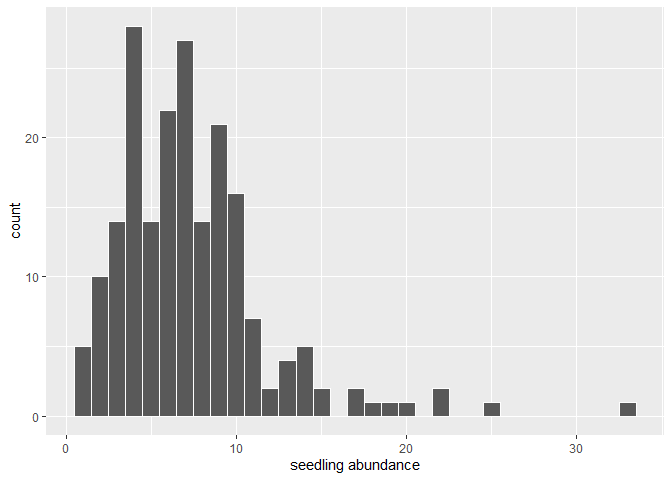
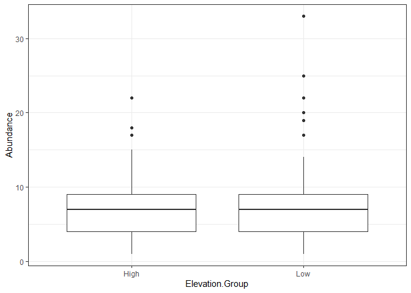
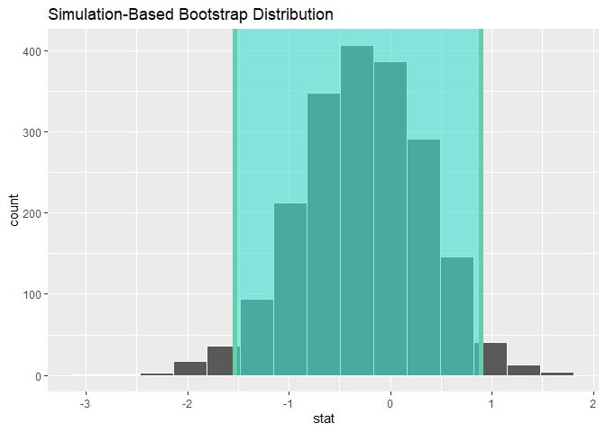
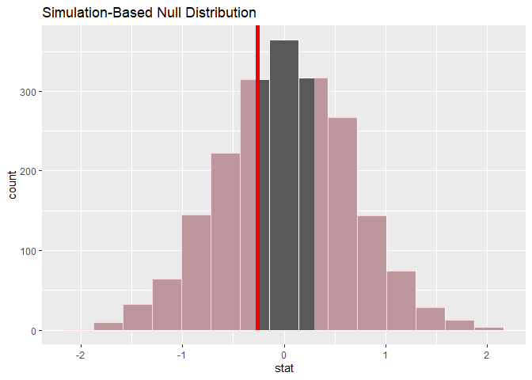
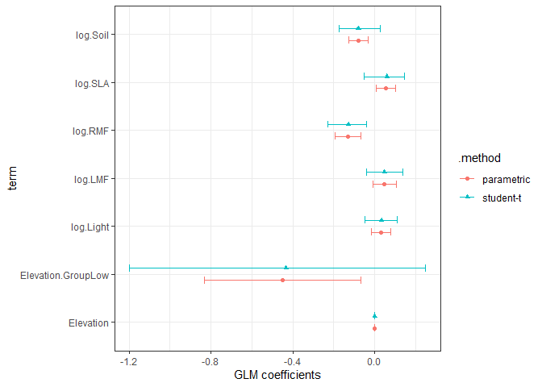
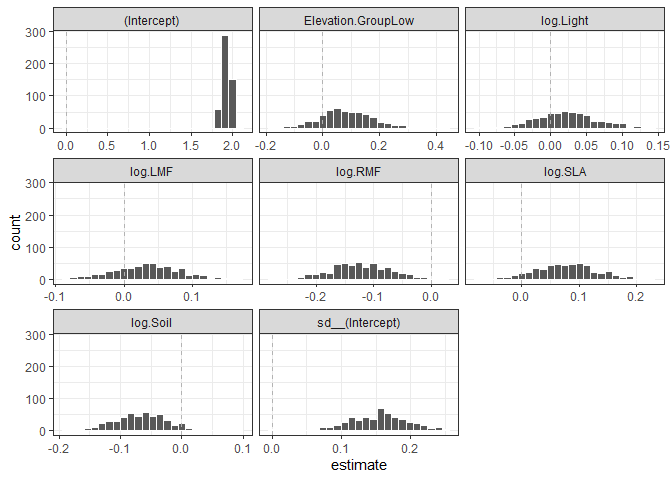

```r
knitr::opts_chunk$set(echo = TRUE, message = FALSE, warning = FALSE)
```

This exercise is designed to test skills learned in Chapter 21: Inferential Analysis from Tidy Modeling in R

This data comes from a tropical rainforest seedling community in Xishuangbanna, China. Originally, the data included trait data measured on individual seedlings and plot-level environmental data and was used to make inferences about how interactions among traits explain patterns of relative growth rate of seedlings across light and soil nutrient gradients. The publication can be found [here](https://esajournals.onlinelibrary.wiley.com/doi/abs/10.1002/ecy.3007). For this exercise, I have adapted the data as well as "made-up" some new variables to better match the chapter data. All the continuous variables have been centered and scaled.

The data include

-   Plot - 1 x 1 meter plots randomly distributed in the forest to capture the seedling community
-   Elevation - Elevation of the plot in meters
-   Elevation.Group - Elevation classified as Low or High
-   Abundance - total number of individual seedlings in each plot
-   log.SLA - mean specific leaf area of all individuals in the plot, ratio of leaf area to leaf dry mass, high values indicate lighter leaves that photosynthesize more quickly.
-   log.LMF - mean leaf mass fraction of all individuals in the plot, total leaf dry mass divided by whole plant dry mass, represents biomass allocation to leaves
-   log.RMF - mean root mass fraction of all individuals in the plot, total root dry mass divided by whole plant dry mass, represents biomass allocation to roots
-   log.Soil - scores from the first axis of PCA, higher values mean more nutrient rich soil
-   log.Light - percent canopy openness above the plot, higher values mean more open canopy and access to light
-   n.Species - number of species in each plot

The goal of this exercise is to try to explain differences in abundance among the plots.

## Exercise 1

Visualize the distribution of seedling abundance data. What do you notice about the distribution?


```r
library(ggplot2)
library(here)
library(tidymodels)
here()
```

```
## [1] "D:/Lingling/13_Rclub/tidy-models"
```


```r
tidymodels_prefer()

ex_data = read.csv(here("tidymodel_exercise/final.data.csv"))
glimpse(ex_data)
```

```
## Rows: 200
## Columns: 10
## $ Plot            <int> 1, 10, 100, 101, 102, 103, 104, 105, 106, 107, 108, 10…
## $ Elevation       <int> 100, 100, 400, 1000, 1000, 1000, 1000, 1000, 1000, 100…
## $ Elevation.Group <chr> "Low", "Low", "Low", "High", "High", "High", "High", "…
## $ Abundance       <int> 7, 7, 13, 2, 10, 15, 22, 12, 10, 9, 14, 4, 4, 6, 3, 10…
## $ n.Species       <int> 7, 5, 4, 1, 4, 6, 8, 6, 5, 6, 6, 4, 4, 3, 3, 7, 5, 5, …
## $ log.SLA         <dbl> -0.61169333, -0.55208932, -0.65518621, -1.38052594, 1.…
## $ log.LMF         <dbl> -1.011630967, -0.587209151, 0.448063427, -2.401020177,…
## $ log.RMF         <dbl> 0.1196850, 1.2755846, 0.1691089, 3.7882477, -0.2525634…
## $ log.Soil        <dbl> 0.20433620, 0.62612973, 1.40806125, 1.26272034, 1.8784…
## $ log.Light       <dbl> 0.09632394, -0.60243708, 0.37582836, 1.63359821, 0.118…
```


```r
ggplot(ex_data, aes(x = Abundance)) + 
  geom_histogram(binwidth = 1, color = "white") + 
  labs(x = "seedling abundance")
```

<!-- -->

The distribution displayed a right skewness.

## Exercise 2

Our first hypothesis is that there is a difference in abundance between Low and High elevation groups. Show how you would summarize the data to test this hypothesis and then analyse the data to test the hypothesis. Hint: This data was collected over the same 1 year period for all of the plots across all elevations. Was the hypothesis supported?


```r
head(ex_data)
```

```
##   Plot Elevation Elevation.Group Abundance n.Species    log.SLA    log.LMF
## 1    1       100             Low         7         7 -0.6116933 -1.0116310
## 2   10       100             Low         7         5 -0.5520893 -0.5872092
## 3  100       400             Low        13         4 -0.6551862  0.4480634
## 4  101      1000            High         2         1 -1.3805259 -2.4010202
## 5  102      1000            High        10         4  1.5507595  0.8698876
## 6  103      1000            High        15         6  0.6523895  1.1950557
##      log.RMF  log.Soil   log.Light
## 1  0.1196850 0.2043362  0.09632394
## 2  1.2755846 0.6261297 -0.60243708
## 3  0.1691089 1.4080612  0.37582836
## 4  3.7882477 1.2627203  1.63359821
## 5 -0.2525634 1.8784482  0.11839008
## 6 -1.2935446 1.3165324 -0.25673426
```


```r
library(ggpubr)

ex_data %>% 
  ggplot(aes(x = Elevation.Group, y = Abundance)) +
  geom_boxplot()+
  theme_bw()
```

<!-- -->

Here I used non-parametric t-test for comparison because the abundance is not normal distributed.
The p-value is 0.63, so the hypothesis is not supported.


```r
ex_data %>% 
  group_by(Elevation.Group) %>% 
  summarise(n = n(), abundance.sum = sum(Abundance))
```

```
## # A tibble: 2 × 3
##   Elevation.Group     n abundance.sum
##   <chr>           <int>         <int>
## 1 High               99           718
## 2 Low               101           759
```


```r
poisson.test(c(718,759), c(99,101)) %>% tidy()
```

```
## # A tibble: 1 × 8
##   estimate statistic p.value parameter conf.low conf.high method     alternative
##      <dbl>     <dbl>   <dbl>     <dbl>    <dbl>     <dbl> <chr>      <chr>      
## 1    0.965       718   0.499      731.    0.870      1.07 Compariso… two.sided
```


## Exercise 3

Let's test the hypothesis under fewer distributional assumptions than the Poisson distribution. 

1. Use the `infer` package to perform a more powerful hypothesis test of the difference in abundance means between the elevation groups. 


```r
library(infer)

observed <- 
  ex_data %>%
  specify(Abundance ~ Elevation.Group) %>%
  calculate(stat = "diff in means", order = c("High", "Low"))
observed
```

```
## Response: Abundance (numeric)
## Explanatory: Elevation.Group (factor)
## # A tibble: 1 × 1
##     stat
##    <dbl>
## 1 -0.262
```

2. Compute a confidence interval around the mean

```r
set.seed(410)
bootstrapped <- 
  ex_data %>%
  specify(Abundance ~ Elevation.Group)  %>%
  generate(reps = 2000, type = "bootstrap") %>%
  calculate(stat = "diff in means", order = c("High", "Low"))
bootstrapped
```

```
## Response: Abundance (numeric)
## Explanatory: Elevation.Group (factor)
## # A tibble: 2,000 × 2
##    replicate   stat
##        <int>  <dbl>
##  1         1  0.418
##  2         2 -0.240
##  3         3 -0.168
##  4         4 -0.678
##  5         5 -0.414
##  6         6 -0.627
##  7         7 -0.504
##  8         8 -1.47 
##  9         9 -2.12 
## 10        10 -0.57 
## # ℹ 1,990 more rows
```


```r
percentile_ci <- get_ci(bootstrapped)
percentile_ci
```

```
## # A tibble: 1 × 2
##   lower_ci upper_ci
##      <dbl>    <dbl>
## 1    -1.53    0.895
```

3. Visualize the bootstrap data with confidence intervals


```r
visualize(bootstrapped) +
    shade_confidence_interval(endpoints = percentile_ci)
```

<!-- -->

4. Calculate a p-value

```r
set.seed(410)
permuted <- 
  ex_data %>%
  specify(Abundance ~ Elevation.Group) %>%
  hypothesize(null = "independence") %>%
  generate(reps = 2000, type = "permute") %>%
  calculate(stat = "diff in means", order = c("High", "Low"))
permuted
```

```
## Response: Abundance (numeric)
## Explanatory: Elevation.Group (factor)
## Null Hypothesis: independence
## # A tibble: 2,000 × 2
##    replicate   stat
##        <int>  <dbl>
##  1         1  0.598
##  2         2  1.22 
##  3         3  0.178
##  4         4  0.418
##  5         5  0.758
##  6         6 -0.882
##  7         7 -1.20 
##  8         8  0.398
##  9         9 -0.842
## 10        10  0.218
## # ℹ 1,990 more rows
```


```r
permuted %>%
  get_p_value(obs_stat = observed, direction = "two-sided")
```

```
## # A tibble: 1 × 1
##   p_value
##     <dbl>
## 1   0.677
```

5. Visualize the permuted p-values with the observed value

```r
visualize(permuted) +
    shade_p_value(obs_stat = observed, direction = "two-sided")
```

<!-- -->


## Exercise 4

The two-sample tests performed above are suboptimal because they do not account for other factors that might explain abundance. We will now move to generalized linear models (glm). 

1. Fit a model of Abundance that includes all predictors in the data frame except Plot and n.Species. Which predictors are significant?


```r
library(poissonreg)

# default engine is 'glm'
log_lin_spec <- poisson_reg()

ex_data1 = ex_data %>% select(-Plot, -n.Species)
log_lin_fit <- 
  log_lin_spec %>% 
  fit(Abundance ~ ., data = ex_data1)
log_lin_fit
```

```
## parsnip model object
## 
## 
## Call:  stats::glm(formula = Abundance ~ ., family = stats::poisson, 
##     data = data)
## 
## Coefficients:
##        (Intercept)           Elevation  Elevation.GroupLow             log.SLA  
##          2.6243977          -0.0005987          -0.4494514           0.0556996  
##            log.LMF             log.RMF            log.Soil           log.Light  
##          0.0478620          -0.1299099          -0.0782649           0.0325981  
## 
## Degrees of Freedom: 199 Total (i.e. Null);  192 Residual
## Null Deviance:	    470.6 
## Residual Deviance: 415.4 	AIC: 1171
```


```r
coef_sum = tidy(log_lin_fit, conf.int = TRUE, conf.level = 0.90)
coef_sum
```

```
## # A tibble: 8 × 7
##   term                estimate std.error statistic  p.value conf.low conf.high
##   <chr>                  <dbl>     <dbl>     <dbl>    <dbl>    <dbl>     <dbl>
## 1 (Intercept)         2.62      0.293         8.94 3.82e-19  2.14     3.11    
## 2 Elevation          -0.000599  0.000257     -2.33 2.00e- 2 -0.00102 -0.000176
## 3 Elevation.GroupLow -0.449     0.232        -1.94 5.24e- 2 -0.831   -0.0684  
## 4 log.SLA             0.0557    0.0290        1.92 5.45e- 2  0.00785  0.103   
## 5 log.LMF             0.0479    0.0340        1.41 1.60e- 1 -0.00804  0.104   
## 6 log.RMF            -0.130     0.0382       -3.40 6.68e- 4 -0.193   -0.0674  
## 7 log.Soil           -0.0783    0.0289       -2.71 6.80e- 3 -0.126   -0.0307  
## 8 log.Light           0.0326    0.0289        1.13 2.60e- 1 -0.0154   0.0797
```


2. Conduct a rough test of the model assumptions

```r
set.seed(410)
glm_boot <- 
  reg_intervals(Abundance ~ ., data = ex_data1, model_fn = "glm", family = poisson)
glm_boot
```

```
## # A tibble: 7 × 6
##   term                 .lower .estimate    .upper .alpha .method  
##   <chr>                 <dbl>     <dbl>     <dbl>  <dbl> <chr>    
## 1 Elevation          -0.00139 -0.000580  0.000129   0.05 student-t
## 2 Elevation.GroupLow -1.20    -0.433     0.249      0.05 student-t
## 3 log.LMF            -0.0413   0.0473    0.137      0.05 student-t
## 4 log.Light          -0.0479   0.0330    0.108      0.05 student-t
## 5 log.RMF            -0.228   -0.128    -0.0396     0.05 student-t
## 6 log.SLA            -0.0538   0.0596    0.144      0.05 student-t
## 7 log.Soil           -0.174   -0.0795    0.0271     0.05 student-t
```


```r
coef_sum = coef_sum %>% mutate(.method = "parametric") %>% 
  rename(.lower = conf.low, .upper = conf.high, .estimate=estimate) %>%
  filter(term != "(Intercept)")
coef_sum
```

```
## # A tibble: 7 × 8
##   term           .estimate std.error statistic p.value   .lower   .upper .method
##   <chr>              <dbl>     <dbl>     <dbl>   <dbl>    <dbl>    <dbl> <chr>  
## 1 Elevation      -0.000599  0.000257     -2.33 2.00e-2 -0.00102 -1.76e-4 parame…
## 2 Elevation.Gro… -0.449     0.232        -1.94 5.24e-2 -0.831   -6.84e-2 parame…
## 3 log.SLA         0.0557    0.0290        1.92 5.45e-2  0.00785  1.03e-1 parame…
## 4 log.LMF         0.0479    0.0340        1.41 1.60e-1 -0.00804  1.04e-1 parame…
## 5 log.RMF        -0.130     0.0382       -3.40 6.68e-4 -0.193   -6.74e-2 parame…
## 6 log.Soil       -0.0783    0.0289       -2.71 6.80e-3 -0.126   -3.07e-2 parame…
## 7 log.Light       0.0326    0.0289        1.13 2.60e-1 -0.0154   7.97e-2 parame…
```


```r
bind_coef = bind_rows(coef_sum, glm_boot)

coef_plot = bind_coef %>% 
  ggplot(aes(x=.estimate, y=term, shape=.method, color = .method)) +
  geom_point(position = position_dodge(width = 0.5)) +
  geom_errorbarh(aes(xmin=.lower, xmax = .upper), height = 0.3, position = position_dodge(width = 0.5))+
  labs(x = "GLM coefficients")+
  theme_bw()
  
coef_plot
```

<!-- -->

3. Determine which predictors to keep in the model. Fit the reduced model with only significant predictor(s) found in Step 2

Should we use the full model or the reduced model?


```r
log_lin_reduced <- 
  log_lin_spec %>% 
  fit(Abundance ~ log.RMF, data = ex_data1)

anova(
  extract_fit_engine(log_lin_reduced),
  extract_fit_engine(log_lin_fit),
  test = "LRT"
) %>%
  tidy()
```

```
## # A tibble: 2 × 6
##   term                     df.residual residual.deviance    df deviance  p.value
##   <chr>                          <dbl>             <dbl> <dbl>    <dbl>    <dbl>
## 1 Abundance ~ log.RMF              198              437.    NA     NA   NA      
## 2 Abundance ~ Elevation +…         192              415.     6     22.1  0.00118
```


## Exercise 5

This data set is not zero-inflated so we will deviate from the book chapter here. Our data does, however, have groupings as part of the set-up where plots were distributed across elevations. Instead of elevation being a predictor, let's make it a random effect in the model. You will need the package `multilevelmod` for this analysis. Hint: Review the engine types to set the correct one. These can be viewed used `?poisson_reg`.

1. Fit a generalized linear mixed-effects model with Elevation as the random effect.

```r
library(multilevelmod)
glmer_spec = poisson_reg() %>% set_engine("glmer")

glmer_fit = 
  glmer_spec %>% 
  fit(Abundance ~ log.SLA + log.LMF + log.RMF + log.Soil + log.Light + Elevation.Group + (1 | Elevation),
      data = ex_data1) 
glmer_fit
```

```
## parsnip model object
## 
## Generalized linear mixed model fit by maximum likelihood (Laplace
##   Approximation) [glmerMod]
##  Family: poisson  ( log )
## Formula: Abundance ~ log.SLA + log.LMF + log.RMF + log.Soil + log.Light +  
##     Elevation.Group + (1 | Elevation)
##    Data: data
##       AIC       BIC    logLik  deviance  df.resid 
## 1165.6795 1192.0660 -574.8397 1149.6795       192 
## Random effects:
##  Groups    Name        Std.Dev.
##  Elevation (Intercept) 0.124   
## Number of obs: 200, groups:  Elevation, 8
## Fixed Effects:
##        (Intercept)             log.SLA             log.LMF             log.RMF  
##            1.93409             0.07454             0.03590            -0.12279  
##           log.Soil           log.Light  Elevation.GroupLow  
##           -0.06412             0.02158             0.08236
```


2. Visualize the tidy model summary. You will need the `broom.mixed` package.

```r
library(broom.mixed)
tidy(glmer_fit)
```

```
## # A tibble: 8 × 7
##   effect   group     term               estimate std.error statistic    p.value
##   <chr>    <chr>     <chr>                 <dbl>     <dbl>     <dbl>      <dbl>
## 1 fixed    <NA>      (Intercept)          1.93      0.0750    25.8    1.19e-146
## 2 fixed    <NA>      log.SLA              0.0745    0.0296     2.52   1.19e-  2
## 3 fixed    <NA>      log.LMF              0.0359    0.0348     1.03   3.02e-  1
## 4 fixed    <NA>      log.RMF             -0.123     0.0387    -3.18   1.49e-  3
## 5 fixed    <NA>      log.Soil            -0.0641    0.0304    -2.11   3.51e-  2
## 6 fixed    <NA>      log.Light            0.0216    0.0294     0.734  4.63e-  1
## 7 fixed    <NA>      Elevation.GroupLow   0.0824    0.108      0.765  4.45e-  1
## 8 ran_pars Elevation sd__(Intercept)      0.124    NA         NA     NA
```


3. Use AIC to compare the full model fit above to the new model with the random effect. Create 500 model fits and extract the AIC values. Which model was better fit? Hint: This is part of the exercises in the book chapter.


```r
anova(
  extract_fit_engine(glmer_fit),
  extract_fit_engine(log_lin_reduced),
  test = "LRT"
) %>%
  tidy()
```

```
## # A tibble: 2 × 9
##   term                 npar   AIC   BIC logLik deviance statistic    df  p.value
##   <chr>               <dbl> <dbl> <dbl>  <dbl>    <dbl>     <dbl> <dbl>    <dbl>
## 1 extract_fit_engine…     2 1181. 1188.  -589.    1177.      NA      NA NA      
## 2 extract_fit_engine…     8 1166. 1192.  -575.    1150.      27.7     6  1.06e-4
```


```r
glmer_fit %>% extract_fit_engine() %>% AIC()
```

```
## [1] 1165.679
```

```r
#> [1] 3232
log_lin_reduced   %>% extract_fit_engine() %>% AIC()
```

```
## [1] 1181.392
```

```r
#> [1] 3312
```


```r
aic_form <- Abundance ~ log.SLA + log.LMF + log.RMF + log.Soil + log.Light + Elevation.Group + (1 | Elevation)
glm_form <- Abundance ~ log.SLA + log.LMF + log.RMF + log.Soil + log.Light + Elevation.Group + Elevation

set.seed(410)
bootstrap_models <-
  bootstraps(ex_data1, times = 500, apparent = TRUE) %>%
  mutate(
    glm = map(splits, ~ fit(log_lin_spec, glm_form, data = analysis(.x))),
    aic = map(splits, ~ fit(glmer_spec, aic_form, data = analysis(.x)))
  )
bootstrap_models
```

```
## # Bootstrap sampling with apparent sample 
## # A tibble: 501 × 4
##    splits           id           glm      aic     
##    <list>           <chr>        <list>   <list>  
##  1 <split [200/71]> Bootstrap001 <fit[+]> <fit[+]>
##  2 <split [200/79]> Bootstrap002 <fit[+]> <fit[+]>
##  3 <split [200/67]> Bootstrap003 <fit[+]> <fit[+]>
##  4 <split [200/69]> Bootstrap004 <fit[+]> <fit[+]>
##  5 <split [200/66]> Bootstrap005 <fit[+]> <fit[+]>
##  6 <split [200/69]> Bootstrap006 <fit[+]> <fit[+]>
##  7 <split [200/67]> Bootstrap007 <fit[+]> <fit[+]>
##  8 <split [200/73]> Bootstrap008 <fit[+]> <fit[+]>
##  9 <split [200/75]> Bootstrap009 <fit[+]> <fit[+]>
## 10 <split [200/75]> Bootstrap010 <fit[+]> <fit[+]>
## # ℹ 491 more rows
```


## Exercise 6

From the bootstrap_models generated above, extract and plot the model coefficients.


```r
bootstrap_models <-
  bootstrap_models %>%
  mutate(
    glm_aic = map_dbl(glm, ~ extract_fit_engine(.x) %>% AIC()),
    aic_aic = map_dbl(aic, ~ extract_fit_engine(.x) %>% AIC())
  )
mean(bootstrap_models$aic_aic < bootstrap_models$glm_aic)
```

```
## [1] 0.8642715
```


```r
bootstrap_models <-
  bootstrap_models %>%
  mutate(zero_coefs  = map(aic, ~ tidy(.x, type = "zero")))

# One example:
bootstrap_models$zero_coefs[[1]]
```

```
## # A tibble: 8 × 7
##   effect   group     term               estimate std.error statistic   p.value
##   <chr>    <chr>     <chr>                 <dbl>     <dbl>     <dbl>     <dbl>
## 1 fixed    <NA>      (Intercept)          1.97      0.0943    20.9    3.95e-97
## 2 fixed    <NA>      log.SLA              0.0653    0.0305     2.14   3.20e- 2
## 3 fixed    <NA>      log.LMF              0.0832    0.0356     2.34   1.93e- 2
## 4 fixed    <NA>      log.RMF             -0.0596    0.0457    -1.30   1.92e- 1
## 5 fixed    <NA>      log.Soil            -0.0885    0.0324    -2.73   6.26e- 3
## 6 fixed    <NA>      log.Light            0.0723    0.0310     2.33   1.98e- 2
## 7 fixed    <NA>      Elevation.GroupLow  -0.0392    0.136     -0.289  7.72e- 1
## 8 ran_pars Elevation sd__(Intercept)      0.168    NA         NA     NA
```


```r
bootstrap_models %>% 
  unnest(zero_coefs) %>% 
  ggplot(aes(x = estimate)) +
  geom_histogram(bins = 25, color = "white") + 
  facet_wrap(~ term, scales = "free_x") + 
  geom_vline(xintercept = 0, lty = 2, color = "gray70")+
  theme_bw()
```

<!-- -->

